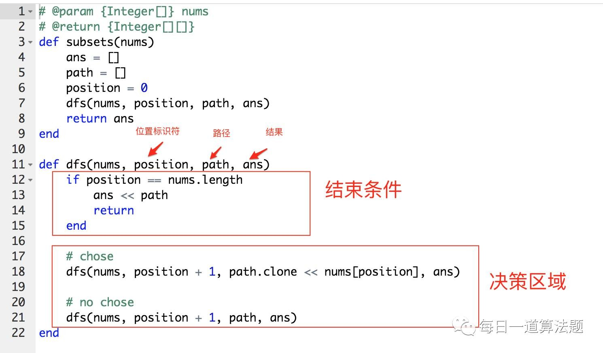

# 算法记录
2017.02.22 [227. Basic Calculator II]() 回退思路和流做法

2017.02.24 [91. Decode Ways](https://mp.weixin.qq.com/s?__biz=MzAwMDk1MTUyNw==&mid=2247484340&idx=1&sn=1c677541d92c24bfed33d7589d4862d7&chksm=9ae0563cad97df2a6b4baf38418a0d8519684f1dc8bdb0b97b5b911df47f1529af0641d95e70&mpshare=1&scene=1&srcid=0227iC1w3zW67E6I2reGFXVa&key=f666d8b5cfa8d8c16da24035dd4c57c5953371c392f57b40047e68a3a78bf03dd4683bfc7896c4fa2fe1f22a8cd3318a3186e9bb9c31ae146a93b5c884451eda15f85699d584fc345eb9712d5b8e9c25&ascene=0&uin=Mjc1MjU2MjcwMA%3D%3D&devicetype=iMac+MacBookPro11%2C1+OSX+OSX+10.11.6+build(15G1004)&version=12010110&nettype=WIFI&fontScale=100&pass_ticket=L7YS3HSQKuiJN5HdBWqWKJzRK9xCL2imInwFT82T219lrAQR0IHvmQ86LxtVpq6f)
 
2017.02.28 [503. Next Greater Element II](https://mp.weixin.qq.com/s?__biz=MzAwMDk1MTUyNw==&mid=2247484355&idx=1&sn=863e6f2ebafef26a89cd0d3e89b453dd&chksm=9ae0564bad97df5dba9ebbae7b018df81873b0ae83d8b30b7206002c081ef8f9c91824aadb1d&scene=0&key=afb5bc5a73f7fbc49ad09f2a71793ccf6f15e9f0d5b4c8b4468a8e648ca6ae7400ce9bc4bfe7aa5c29b1bc9d3c4c61d037b112bb0038300bfa84e3518fc4f2ec6e087044d5caf41bfac87c2fb62270a0&ascene=0&uin=Mjc1MjU2MjcwMA%3D%3D&devicetype=iMac+MacBookPro11%2C1+OSX+OSX+10.11.6+build(15G1004)&version=12010110&nettype=WIFI&fontScale=100&pass_ticket=KvcO%2BTXK45u%2Blm5Pk2WGvd2hk3hugg4bM%2FSymdqqINx4%2FmNob1zt4GzrcJIn9YI6)

2017.02.28 [451. Sort Characters By Frequency](http://mp.weixin.qq.com/s/MNHpeCgPJgXSuip61U3P5g)

2017.03.01 [215.Kth Largest Element in an Array]()

2017.03.02 [150.Evaluate Reverse Polish Notation]()

2017.03.03 [373.Find K Pairs with Smallest Sums](http://mp.weixin.qq.com/s?__biz=MzAwMDk1MTUyNw==&mid=2247484396&idx=1&sn=7695c3ab485d4c7f4d6550abb6a6bf1d&chksm=9ae05664ad97df728981365be049a404adb29d20d06ff9c2184a6281a83bfc27434396d8db9d&scene=4#wechat_redirect)

2017.03.05 [402. Remove K Digits](https://mp.weixin.qq.com/s?__biz=MzAwMDk1MTUyNw==&mid=2247484417&idx=1&sn=5d600014052d6891029377cca3405dad&chksm=9ae05189ad97d89faa4a79bc499a9bfb728f504b5b26c70eb0d3121d55c21a3e818fd5cb690b&scene=0&key=5578552f11f7803551c48930ba757c4d80cd95d686617c59a4326d9e5bad66b10a358e7e36c13f2057a6128ff85d329801a7ef7cb3f7ed03aeed0378dcfacc7d3800690704abb833c4a211f1c86872f3&ascene=0&uin=Mjc1MjU2MjcwMA%3D%3D&devicetype=iMac+MacBookPro11%2C1+OSX+OSX+10.11.6+build(15G1004)&version=12020010&nettype=WIFI&fontScale=100&pass_ticket=Wf39deTrQE%2B58toXSKQbLBUNOPahAzxAE8Y6ZyiUd8BMu31nBHHdr2HX3yzA%2BAIn)

2017.03.05 [224. Basic Calculator](http://mp.weixin.qq.com/s?__biz=MzAwMDk1MTUyNw==&mid=2247484436&idx=1&sn=61ce4f4a00e360dbace7968b5ef57048&chksm=9ae0519cad97d88ae98e73d81ce5204bec37d21c885a4e75ab6fdc62423b15f1a0d74205ada4&scene=4#wechat_redirect) 重点是stack保存状态

2017.03.06 [202. Happy Number](https://mp.weixin.qq.com/s?__biz=MzAwMDk1MTUyNw==&mid=2247484469&idx=1&sn=00591d0941b709ad4aa48e351f69ac34&chksm=9ae051bdad97d8ab279a862b8a801c936b61e11d17c7164cb39abcf3978d125d52a3969fc6bb&mpshare=1&scene=1&srcid=0306eSTjcc8MYwB7jFCoTsfH&key=35474a3d8332a50929bd33c043081b9abe3d2b72f0204a345cfc28607e0cfbfc9339c15f9a18bacb6612aea647771f06757c82a4342dafdeaa8635a2c6797c6244a75f630b259be3cf91223ac797fe85&ascene=0&uin=Mjc1MjU2MjcwMA%3D%3D&devicetype=iMac+MacBookPro11%2C1+OSX+OSX+10.11.6+build(15G1004)&version=12020010&nettype=WIFI&fontScale=100&pass_ticket=L3U5lih50IxxNhimznIzJ1CasY9FcLCCdEka2mDaIssMUWa%2FRJip0y2yYeckqpSM)

2017.03.07 [263. Ugly Number]()

2017.03.08 [264. Ugly Number II](https://mp.weixin.qq.com/s?__biz=MzAwMDk1MTUyNw==&mid=2247484496&idx=1&sn=9da033c35980f6c6c0718761482a8f08&chksm=9ae051d8ad97d8ced6a6fb40d54720cc55d5e24d7d06e248d410962abddba58b8375b813b7ec&mpshare=1&scene=1&srcid=0310STao5FCLIMPcCCHyoHvT&key=ae8640fe4340b04e329edd4a4d3b7fcb029b0c2a0a3f71bffb78d3e48ec561f97f5eef9f3bc6ec220ab75210c63261bcb80551b72f94a176a723ac25cc91bfd8756cf13f0b4495635633fcfd80f4fb40&ascene=0&uin=Mjc1MjU2MjcwMA%3D%3D&devicetype=iMac+MacBookPro11%2C1+OSX+OSX+10.11.6+build(15G1004)&version=12020010&nettype=WIFI&fontScale=100&pass_ticket=jFhUA%2FDW7BiigrLaHWTNxtSXM96Xdx6%2Ff4PlRt5gPaUaXjtB5v4Z3eRZLdb1JpnI)

2017.03.09 [313. Super Ugly Number]()

2017.03.10 [166. Fraction to Recurring Decimal](http://mp.weixin.qq.com/s?__biz=MzAwMDk1MTUyNw==&mid=2247484533&idx=1&sn=520f564800a76533e03fe71296f80766&chksm=9ae051fdad97d8eb0df49429cb2072b8fbf1c120ec2d56c4b1edcdf828dbcbcb15f9c479ea43&scene=21#wechat_redirect)

2017.03.15 [483. Smallest Good Base](https://mp.weixin.qq.com/s?__biz=MzAwMDk1MTUyNw==&mid=2247484563&idx=1&sn=bc6b42d2b521e8320089799efd0bbd58&chksm=9ae0511bad97d80d89935632b09cf1240770c2661100eaba41b71e517d30ab4a2e0cdc173d95&scene=0&key=ba1020d849de95c44b8fb66a59ef06de1dae12eb5a0430c1aaa36ad70e3984fb0602a640522f1e39b1570663a4411a02123aafc48534c6613a1d02d7f47d621330772d0f1ca01bf9ef3c9d508358a2a9&ascene=0&uin=Mjc1MjU2MjcwMA%3D%3D&devicetype=iMac+MacBookPro11%2C1+OSX+OSX+10.11.6+build(15G1004)&version=12020010&nettype=WIFI&fontScale=100&pass_ticket=eEEhdXEB677ozGW99kQ5q61m2Z2bqv5EGY4YJ3jvBrGSdZYcKQa4MJIfo02f7ozD)

2017.03.19 [74. Search a 2D Matrix](https://mp.weixin.qq.com/s?__biz=MzAwMDk1MTUyNw==&mid=2247484587&idx=1&sn=dc4918a6a0499bafe786b3f6ec7ae872&chksm=9ae05123ad97d835122f7f53aca5316623730267e8f2171831f93c32a6e75a0cc881edd746aa&mpshare=1&scene=1&srcid=0320E3VITSa37MuNEVt7zddT&key=8b1ec02b44dde3bc5f8dbae3bb483353d20cbfc85eebe87d22c7480a2fa576cc073499528c686c6caab93b6befd766677bbe4372a81ce057564d1f3a61e49a865219e2b8c3fdd618d79393213c36f064&ascene=0&uin=Mjc1MjU2MjcwMA%3D%3D&devicetype=iMac+MacBookPro11%2C1+OSX+OSX+10.11.6+build(15G1004)&version=12020010&nettype=WIFI&fontScale=100&pass_ticket=6GisGpgvR6ZpIWR6nfPMIYcbe%2Be5WkHR%2Ftr%2FdKC66E8Q2SpYU1rvIO0h7NSVopwI)

2017.03.20 [240. Search a 2D Matrix II](https://mp.weixin.qq.com/s?__biz=MzAwMDk1MTUyNw==&mid=2247484599&idx=1&sn=b5990d7695462315247b8e64bfe1ad10&chksm=9ae0513fad97d829058690313f96c9a352d4572704ab3da685dbc3954afa54ffb0b8c40e1570&mpshare=1&scene=1&srcid=03205Y4KQ4tQdTL4W9Tso34f&key=1d95f5a097bd6c46fb63d973ef3e79f05813e7bec05de2cc4ac355e70c0c8ca8e1cd5d12022f314c2c3c0fed4359584874bc2d41f9a58ac744a34b74a4fcf8d5fd6a85fc3318a85cbabe448ff70ea2eb&ascene=0&uin=Mjc1MjU2MjcwMA%3D%3D&devicetype=iMac+MacBookPro11%2C1+OSX+OSX+10.11.6+build(15G1004)&version=12020010&nettype=WIFI&fontScale=100&pass_ticket=6GisGpgvR6ZpIWR6nfPMIYcbe%2Be5WkHR%2Ftr%2FdKC66E8Q2SpYU1rvIO0h7NSVopwI)

2017.03.20 [154. Find Minimum in Rotated Sorted Array II](https://mp.weixin.qq.com/s?__biz=MzAwMDk1MTUyNw==&mid=2247484610&idx=1&sn=3c0bdbd69c58e6d973cf308d8f088a1f&chksm=9ae0514aad97d85cbc645b8bb4002891df3d34051556b79ce09ab8fb13bc8f91189014275981&mpshare=1&scene=1&srcid=0320Rfux7EH0Lv6VE9V1shvP&key=7c8875ff305130601d537afab001ded67d1811b49cf9768e570192870e04df39a7394a2ad44baa6b5da8acf1639f753d0df93c655d62e1a1e08071c39380bbb50c7f0480387344251d3eb5c2504a5c81&ascene=0&uin=Mjc1MjU2MjcwMA%3D%3D&devicetype=iMac+MacBookPro11%2C1+OSX+OSX+10.11.6+build(15G1004)&version=12020010&nettype=WIFI&fontScale=100&pass_ticket=6GisGpgvR6ZpIWR6nfPMIYcbe%2Be5WkHR%2Ftr%2FdKC66E8Q2SpYU1rvIO0h7NSVopwI)

2017.03.23 dp [174. Dungeon Game](https://mp.weixin.qq.com/s?__biz=MzAwMDk1MTUyNw==&mid=2247484631&idx=1&sn=01b04e68eadede4049a509d2d8895a50&chksm=9ae0515fad97d8492db97f0b5e47b2bdca5e26407cbdc157454817e2c1467c4e20dfa3e1686c&mpshare=1&scene=1&srcid=0323zaMc0UvUf3dGl4N0RBeQ&key=1d95f5a097bd6c467dffb3c8b26e6579b77a7062c6cb14788f6696baaf036bfcd5a065e750f1891068d11107274beec35ad3c94d013772e758e6f17e6679916ff5e45387f43b484028793290c257c441&ascene=0&uin=Mjc1MjU2MjcwMA%3D%3D&devicetype=iMac+MacBookPro11%2C1+OSX+OSX+10.11.6+build(15G1004)&version=12020010&nettype=WIFI&fontScale=100&pass_ticket=Uw64KV%2F2drOgGJU%2BDNh6aCfLQCsl3SRHdSuIqOCGWfGhpuAoPlifq3W5uqIKc1Wj)

2017.03.23 [131. Palindrome Partitioning]()

2017.03.24 [78. Subsets]()

2017.03.24 [89. Gray Code]()

2017.03.24 [79. Word Search]()

2017.03.29 [47. Permutations II]()

2017.03.29 [140. Word Break II](http://chuansong.me/n/1713762752324)

# 总结

[分治算法 (Divid and Conquer) 总结](http://mp.weixin.qq.com/s?__biz=MzAwMDk1MTUyNw==&mid=2247484032&idx=2&sn=804ba04be9bd94df3752115d394731e3&chksm=9ae05708ad97de1eb839f7bd416b6e3627e6f2354c835e8c95b1e39e8505c9cd7bc2cc12e0c4&scene=21#wechat_redirect)

[回朔总结](http://chuansong.me/n/1697317552217)

